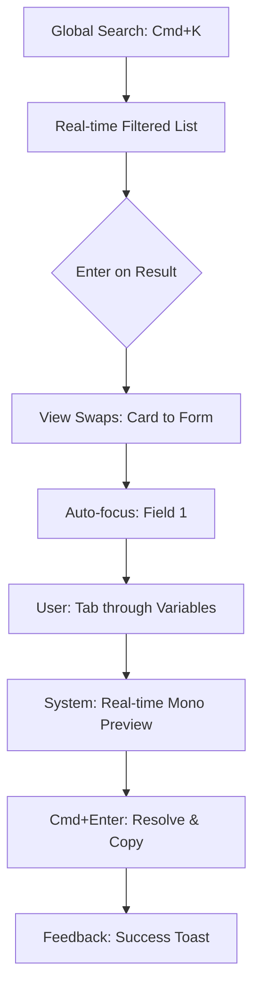
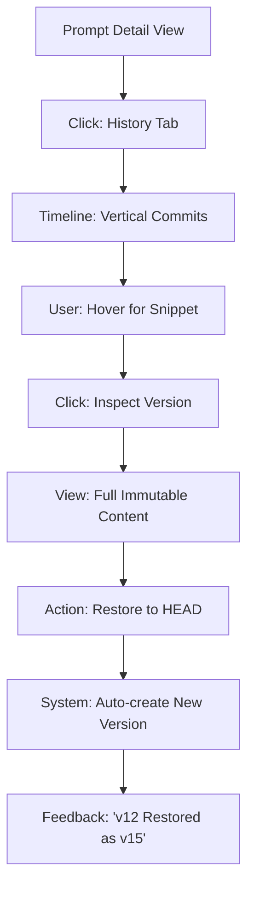

# UX Design Specification prompt-repo

**Author:** pedroid
**Date:** 2026-02-07

---

<!-- UX design content will be appended sequentially through collaborative workflow steps -->

## Executive Summary

### Project Vision
PromptRepo is a "Git for prompts"—a professional-grade vault that treats AI prompts as first-class, versioned, and templated artifacts. The UX is designed to be a high-velocity "sidecar" to the developer's primary coding environment, transforming prompt management from a secondary task into a precise engineering workflow.

### Target Users
- **Primary Persona:** "Alex" (The Prompt Architect). A senior-level technical professional who views prompt engineering as a core craft. Alex requires sub-100ms responsiveness and keyboard-driven navigation to maintain flow state while building complex AI-augmented software.
- **Secondary Persona:** "The Team Lead" (Future). Looking for consistency across prompt libraries, but initially focused on personal productivity and "dogfooding" their own best practices.

### Key Design Challenges
- **High-Density Sidebar Constraints:** The product must remain fully functional and visually clean at widths as narrow as 400px to allow for side-by-side IDE usage.
- **Regex-Form Synergy:** Automatically detecting `{{variables}}` and generating an intuitive input form without breaking the user's mental model of the underlying prompt text.
- **Frictionless Versioning:** Encouraging "Alex" to add version notes without slowing down the high-speed "save and reuse" loop.

### Design Opportunities
- **"Just-in-Time" Resolution:** Creating a "magical" interaction where selecting a prompt immediately presents a tailored input UI, making the transition from "searching" to "pasting" feel instantaneous.
- **The "Repo" Aesthetic:** Using a minimalist, terminal-adjacent design language (via shadcn/ui) that reinforces the mental model of a robust version-control system.

## Core User Experience

### Defining Experience
The core experience of PromptRepo is the **High-Velocity Retrieval Loop**: Search → Auto-Form → Resolve → Copy. Every other feature exists to support this cycle. The goal is to make prompt reuse feel like a natural extension of the developer's thought process rather than a context-switching chore.

### Platform Strategy
- **Environment:** Authenticated Web Application (Next.js 15).
- **Form Factor:** Optimized for "Pinned Sidebar" windows (400px–600px).
- **Input Model:** Keyboard-first. Support for `Cmd+K` style navigation and `Tab` indexing through dynamic variables.
- **Data Integrity:** Real-time optimistic UI for saves with backend immutability for versions.

### Effortless Interactions
- **Zero-Config Forms:** Users don't "define" variables; they simply type `{{var}}` and the system handles the rest.
- **Focus Hand-off:** Selecting a search result immediately places the cursor in the first variable field.
- **Instant Resolution:** The final prompt resolves in real-time as the user types, requiring zero "preview" clicks.

### Critical Success Moments
- **The "Magic" Moment:** Seeing a complex text prompt transform into a structured input form for the first time.
- **The "Saved" Moment:** Realizing a quick tweak to a prompt has been automatically versioned, removing the fear of losing work.
- **The "Flow" Moment:** Copying a resolved prompt and pasting it into the IDE without having touched the mouse once.

### Experience Principles
- **Velocity Over Chrome:** Prioritize performance and interaction speed over decorative UI elements.
- **Immutable Trust:** Ensure version history is always accessible and never destructive.
- **Keyboard Primary:** If a core action can't be done with a shortcut, the UX is considered broken.
- **High-Density Legibility:** Use typography and spacing that remains clear in narrow, high-information views.

## Desired Emotional Response

### Primary Emotional Goals
The primary emotional goal is **Precision Empowerment**. Users should feel like they have a specialized, professional-grade tool that respects their time and intellectual property. The experience should oscillate between **High-Focus Flow** (during use) and **Systemic Relief** (knowing their prompts are versioned).

### Emotional Journey Mapping
- **Discovery:** **Skeptical Curiosity.** "Is this actually better than my Markdown file?"
- **The "Aha!" Moment:** **Delight & Wonder.** Seeing `{{tech_stack}}` turn into a real input field instantly.
- **Task Completion:** **Quiet Accomplishment.** The prompt is copied, and they are back in their code within seconds.
- **Recovery:** **Systemic Calm.** "I broke the prompt, but I can revert to v13 in one click."

### Micro-Emotions
- **Confidence:** Bolstered by keyboard shortcuts and sub-100ms response times.
- **Trust:** Reinforced by immutable version history and explicit "Saved" feedback.
- **Delight:** Triggered by the "just-in-time" generation of variable forms.

### Design Implications
- **Confidence → Interaction Design:** Focus management must be perfect. When a search result is selected, the user should be typing in the first variable field immediately.
- **Trust → Visual Design:** Use Monospace fonts for prompt content and clear, version-controlled metadata. Avoid "fluffy" or overly playful aesthetics.
- **Efficiency → Motion Design:** Use extremely fast, functional transitions. Toasts should be helpful but vanish quickly to avoid cluttering the sidebar.

### Emotional Design Principles
- **Respect the Flow:** Never interrupt the user with non-essential modals or marketing pop-ups.
- **Value Precision Over Polish:** A UI that feels "engineered" builds more trust with this persona than one that feels "marketed."
- **Make Errors Reversible:** Every save is a new version, removing the anxiety of "overwriting" greatness.

## UX Pattern Analysis & Inspiration

### Inspiring Products Analysis
- **Raycast:** Masterful use of the "Cmd+K" pattern and near-instant feedback. It transforms search into a navigation engine.
- **GitHub:** The gold standard for version control visibility. The transparency of "what changed when" creates unbreakable user trust.
- **Linear:** A prime example of high-density, performance-first UI. It feels multipurpose and rewards keyboard mastery.

### Transferable UX Patterns
- **Command-Palette Navigation:** Using a global search overlay or high-focus search bar as the primary entry point for all actions (Search -> Resolve).
- **Immutable Timeline View:** Presenting version history as a vertical sequence of events with clear "Restore" actions, mimicking a Git commit log.
- **Sidecar Density Strategy:** Adopting the information density patterns found in IDE sidebars, ensuring the UI remains legible and functional in narrow viewports.

### Anti-Patterns to Avoid
- **Excessive Modals:** Forcing users to click through multiple dialogs to fill variables. The form should feel inline or like a natural transition within the sidebar.
- **Ambiguous Saves:** Auto-saving without visual feedback. Users need to know exactly when a new version is created.
- **Wasted White Space:** Using large "marketing-style" padding that forces unnecessary scrolling in a small window.

### Design Inspiration Strategy
**What to Adopt:**
- **Keyboard-First Workflows:** Because speed is Alex's primary requirement.
- **Terminal-Adjacent Aesthetic:** Monospaced fonts and subtle borders to reinforce the "Git for prompts" identity.

**What to Adapt:**
- **Variable Forms:** Instead of a generic form, create a "Just-in-Time" UI that appears only when `{{variables}}` are detected, maintaining a clean state otherwise.

**What to Avoid:**
- **Mobile-First Responsive Patterns:** Avoid "Hamburger menus" or hidden sidebars within our own sidebar; prioritize a flat, visible hierarchy.

## Design System Foundation

### 1.1 Design System Choice
**shadcn/ui + Tailwind CSS**

### Rationale for Selection
- **Alignment with Tech Stack:** Perfectly integrates with the chosen Next.js 15 and TypeScript ecosystem.
- **Development Velocity:** Provides high-quality, accessible components (Radix UI) immediately, allowing the developer to focus on the custom resolution engine logic.
- **Deep Customization:** The "copy-paste" architecture of shadcn/ui ensures we can modify component internals to achieve the "Terminal-Adjacent" aesthetic without fighting library constraints.
- **Sidebar-First Control:** Tailwind's utility-first approach is essential for managing the high-density layout required for 400px–600px viewports.

### Implementation Approach
- **Base Theme:** Use the `Zinc` color palette for a neutral, "engineered" professional foundation.
- **Dark Mode:** Prioritize a dark-first aesthetic to match common developer environments (Cursor/VS Code).
- **Component Strategy:** Leverage the `Command`, `ScrollArea`, `Form`, and `Sheet` components as the core building blocks for the sidebar experience.

### Customization Strategy
- **Typography:** Global application of Monospace fonts (Geist Mono or JetBrains Mono) for all prompt content and variable fields.
- **Information Density:** Overriding default shadcn padding to create a "Compact" mode that maximizes visible content in narrow views.
- **Visual Cues:** Incorporate subtle Git-inspired iconography (e.g., commit hashes for version IDs, branch paths for collections).

## 2. Core User Experience

### 2.1 Defining Experience
The defining experience of PromptRepo is the **High-Velocity Retrieval Loop**: moving from a felt need to a resolved, clipboard-ready prompt in under 15 seconds. It transforms the static "note-taking" task into an active "utility" interaction, where the user feels they are "running" a template rather than just reading a file.

### 2.2 User Mental Model
Users bring a **"Git + Command Palette"** mental model to PromptRepo. They expect the search speed of Raycast and the version-controlled security of GitHub. They currently view their prompts as "unstructured code" and look to PromptRepo to provide the "IDE" for that code—complete with variables and history.

### 2.3 Success Criteria
- **Search Latency:** Results render in < 100ms.
- **Form Generation:** Zero lag between prompt selection and form visibility.
- **Tactility:** Immediate focus transition to the first input field upon selection.
- **Copy Confirmation:** Explicit but non-intrusive feedback (toast) that the action is complete.

### 2.4 Novel UX Patterns
- **Just-in-Time Resolution Engine:** A novel interaction pattern where selecting a text object (the prompt) dynamically replaces the current view with a generated interface (the form) based on content parsing (regex).
- **Hybrid Preview:** Combining a traditional form view with a live-updating monospaced preview of the final string, ensuring the user always knows exactly what will hit their clipboard.

### 2.5 Experience Mechanics
1. **Initiation:** The user invokes the global search via `Cmd+K` or focuses the persistent search bar.
2. **Interaction:**
   - **Filtered Search:** Real-time filtering of titles, content, and tags.
   - **Selection:** `Enter` on a search result triggers the **Resolution Mode**.
   - **Variable Entry:** The user `Tabs` through auto-detected variable fields.
3. **Feedback:** The "Resolved Preview" updates character-by-character as the user types.
4. **Completion:** `Cmd+Enter` or clicking the primary "Copy" button resolves the prompt, copies it to the system clipboard, and fires a "Copied" toast notification.

## Visual Design Foundation

### Color System
**Theme:** Kanagawa (Dark)
- **Base Surface:** `#1f1f28` (Dragon)
- **Text Primary:** `#dcd7ba` (Fuji)
- **Interactive/Primary:** `#7e9cd8` (Crystal Blue)
- **Success State:** `#98bb6c` (Spring Green)
- **Border/Subtle:** `#2d4f67` (Suminkashi)
- **Semantic Mapping:** Accent colors used for syntax highlighting in prompts and status indicators for versions.

### Typography System
- **Sans-Serif (UI):** `Geist Sans`. Used for navigation, collection names, and secondary labels.
- **Monospace (Content):** `Geist Mono`. **Mandatory** for prompt text, variable input fields, and the resolved preview.
- **Type Scale:** 
  - Header: 16px (Semi-bold)
  - Metadata: 12px (Medium)
  - Content: 14px (Regular, 1.5 line-height)

### Spacing & Layout Foundation
- **Grid:** Sidebar-centric layout optimized for 400px–600px widths.
- **Spacing Unit:** 4px base (Tailwind scale).
- **Component Density:** High. Use `py-1` and `px-2` defaults for list items to allow for 10+ visible prompts without scrolling.
- **Visual Hierarchy:** Elevation is handled through subtle border-colors (`Suminkashi`) rather than heavy shadows to keep the UI feeling "flat" and engineered.

### Accessibility Considerations
- **Contrast:** Ensure all text-on-background combinations meet WCAG 2.1 AA (4.5:1 ratio).
- **Focus States:** High-visibility focus rings in `Crystal Blue` for keyboard-driven navigation.
- **Color Blindness:** Supplement status colors (Green/Red) with icons (Check/Cross) for version status.

## Design Direction Decision

### Design Directions Explored
We explored three primary visual directions:
1. **The Pure Terminal:** High-density, 100% monospaced, minimal UI.
2. **The Modern Sidecar:** Standard shadcn/ui patterns, mixed typography, high trust.
3. **The Focused Resolver:** A slide-over modal approach prioritizing form entry.

### Chosen Direction
**The "Hybrid Engineer" (Modern Sidecar Layout + Terminal Typography)**
This direction uses the structured, card-based layout of the Modern Sidecar but applies the rigorous, monospaced typographic system of the Pure Terminal.

### Design Rationale
- **Layout:** The structured cards and persistent search bar of the "Modern Sidecar" provide the best information hierarchy for scanning large prompt libraries in a narrow sidebar.
- **Typography:** The 100% monospaced font system (`Geist Mono`) reinforces the mental model that prompts are "logic artifacts" (code) rather than just "notes."
- **Synergy:** This hybrid approach satisfies the persona's (Alex) need for both professional UI stability and a specialized developer-tool aesthetic.

### Implementation Approach
- **Base:** shadcn/ui `Command`, `Card`, and `Form` components.
- **Theming:** Global `font-mono` override for all text elements.
- **Kanagawa Integration:** Use "Dragon" (#1f1f28) for the background and "Crystal Blue" (#7e9cd8) for terminal-style command highlights.
- **Density:** Tight padding (Tailwind `p-2` to `p-3`) to maintain the terminal-like information density within the structured sidecar cards.

## User Journey Flows

### 1. The Core Craftsmanship (Retrieval)
**Goal:** Find, resolve, and copy a prompt in under 15 seconds.

### 2. The Version Regret (Recovery)
**Goal:** Identify and restore a known "golden" version after a failed experiment.

### Journey Patterns
- **The "Context Swap":** Instead of navigating to new pages, the sidebar view swaps its internal component (Library -> Resolver). This preserves the user's mental spatial context.
- **Immediate Focus:** Every primary action (opening search, selecting a prompt) is immediately followed by a programmatic focus placement to the next logical input.
- **Non-Destructive Navigation:** Users can always "Esc" back from Resolver mode to the Search list without losing their search query.

### Flow Optimization Principles
- **Predictive Defaults:** The resolution engine caches the most recent entries for each variable to minimize typing for recurring tasks.
- **Monospaced Clarity:** The "Resolved Preview" uses exactly the same font and color as the target LLM interface (Claude/ChatGPT), creating a "What You See is What You Paste" experience.
- **Keyboard Primary:** Every node in the diagrams above is mapped to a specific keyboard shortcut (`Cmd+K`, `Tab`, `Esc`, `Cmd+Enter`).

## Component Strategy

### Design System Components
We leverage **shadcn/ui** for the foundational interface structure, providing accessible and themeable building blocks that align with the Kanagawa aesthetic.
- **Command:** The primary entry point for high-speed prompt retrieval.
- **Form/Input:** Essential for the dynamic variable resolution interface.
- **ScrollArea:** Critical for managing long prompt lists and version history in a fixed-height sidebar.
- **Toast:** Non-disruptive feedback for clipboard and save actions.

### Custom Components

#### 1. Dynamic Resolver Form
**Purpose:** Transform a raw text prompt into an interactive variable input interface.
**Anatomy:** A vertical stack of labeled input fields generated via regex parsing of `{{variables}}`.
**Interaction:** Auto-focuses the first field; updates the global "Resolved Preview" component on every keystroke.

#### 2. Version Timeline (The Git Log)
**Purpose:** Visualize the lineage of a prompt and enable one-click recovery.
**Anatomy:** A vertical node-based timeline showing version numbers, short hashes, timestamps, and optional version notes.
**States:** Hovering a node reveals a content snippet; selecting a node opens the full historical inspection view.

#### 3. High-Density Monospace Preview
**Purpose:** Provide real-time feedback of the final resolved prompt string.
**Anatomy:** A `font-mono` text block with subtle syntax highlighting for variable values to distinguish them from template text.
**Interaction:** Acts as both a visual confirmation and a primary "Click to Copy" target.

### Component Implementation Strategy
- **Token Synergy:** All custom components must use the standard Tailwind zinc/kanagawa color tokens established in the foundation.
- **Keyboard Accessibility:** Every custom interaction must be Tabbable and support `Enter`/`Space` activation.
- **Reflow Strategy:** Components are designed to stack vertically, ensuring no information is clipped at 400px sidebar width.

### Implementation Roadmap
- **Phase 1 (MVP):** Foundation shadcn components, Dynamic Resolver Form, and High-Density Preview.
- **Phase 2:** Version Timeline (Standard view), Search shortcut enhancements.
- **Phase 3:** Compact Timeline variants, Visual Diff components (v2).

## UX Consistency Patterns

### Button Hierarchy
- **Primary (Crystal Blue):** Main action: **Copy Resolved Prompt**.
- **Secondary (Suminkashi):** **Restoring a Version**, **Creating a New Prompt**.
- **Danger (Surimi Orange):** **Delete Version**, **Delete Prompt**.

### Feedback Patterns
- **Action Success (Toast):** Subtle bottom-center toast in **Spring Green**. Example: *"v13 Copied."*
- **System Status (In-line):** "Saved" or "Syncing" indicator next to the version tag.
- **Error (Toast):** High-visibility toast in **Surimi Orange**.

### Form Patterns
- **Monospaced Inputs:** All variable fields use `font-mono`.
- **Auto-Focus:** Focus forced to first variable field upon entering Resolution Mode.
- **Real-Time Validation:** Input errors appear as the user types.

### Search & Discovery Patterns
- **Cmd+K Trigger:** Global palette activation.
- **Zero Results Path:** Failed search prompts "Create New from '[query]'".
- **Density Over Spacing:** Sidebar list items use minimal padding to maximize visible results.

## Responsive Design & Accessibility

### Responsive Strategy
PromptRepo employs a **Sidebar-First** responsive strategy. The primary interaction model is optimized for a narrow "sidecar" viewport (400px–600px) typical of developers working with side-by-side windows. On larger displays, the interface expands to a multi-pane layout to support advanced operations like version diffing and batch organization.

### Breakpoint Strategy
- **Compact (Sidebar):** 320px - 600px. Single column stack. Library and Resolver views swap contextually.
- **Expanded (Standard):** 601px - 1024px. Multi-pane layout. Library and Resolver visible simultaneously.
- **Wide (Pro):** 1025px+. Multi-column view including version history timeline and diff panes.

### Accessibility Strategy
- **Compliance Level:** WCAG 2.1 AA.
- **Keyboard Primary:** 100% of core "Search -> Resolve -> Copy" loop is keyboard-completable.
- **Focus Management:** Programmatic focus hand-off between search results and variable input fields.
- **Visual Contrast:** All interactive text must meet 4.5:1 contrast ratio against the Kanagawa "Dragon" background.
- **Screen Readers:** Semantic HTML with meaningful `aria-labels` for commit hashes and version status icons.

### Testing Strategy
- **Viewport Resilience:** Manual validation at the 400px "Pinned Sidebar" width to ensure zero content clipping.
- **Automated Audits:** Continuous accessibility testing using `axe-core` integration.
- **Keyboard-Only Walkthroughs:** Regular verification of the flow state without mouse interaction.

### Implementation Guidelines
- **Relative Units:** Use `rem` and `em` for typography and spacing to ensure scaling.
- **Safe Tap Targets:** Minimum 44x44px for all mobile-responsive interactive elements.
- **Focus Indicators:** High-visibility, non-destructive focus rings in "Crystal Blue" for all inputs and buttons.